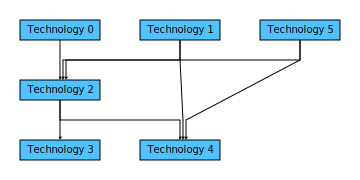

# Tech Tree Visualizer


[](https://codecov.io/gh/Orchaldir/tech_tree)

This project allows the user to define tech trees in yaml files and visualize them as SVG.

An example tech tree can be found in [example.yaml](resources/example.yaml).
It can be visualized with: 

```terminal
tech_tree_cli resources/example.yaml
```

The output is an SVG image:

